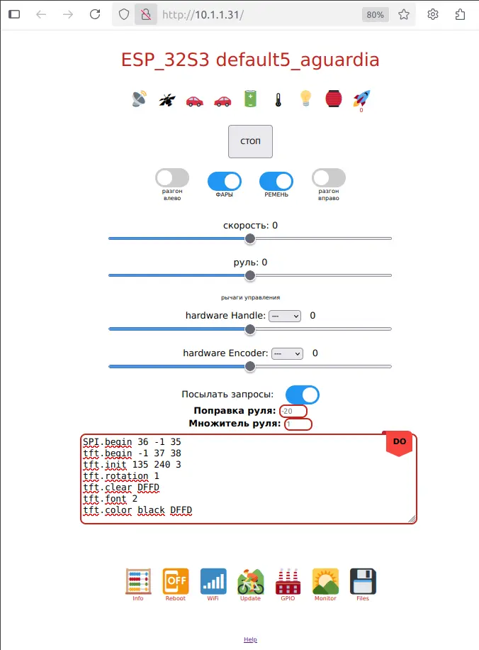

# Универсальный фреймворк ESP12/ESP32

Фреймворк использует собственный язык [CFAQ](https://lleo.me/ESP8266/cfaq) и позволяет вести разработку
и отладку прямо на чипе в онлайне без постоянной перекомпиляции кода без особого ущерба для
производительности.

